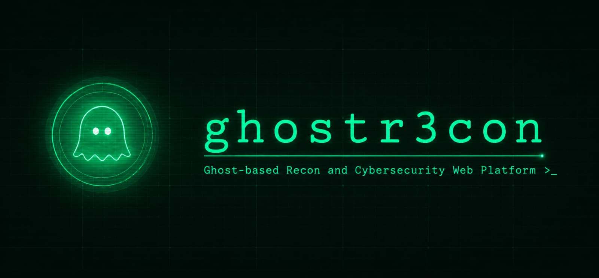

 

# GhostR3con
Frontend UI/UX repository for the Ghost R3con cybersecurity dashboard built with React.js and Tailwind CSS

# Tech Stack

## Languages
 - HTML5: Semantic markup and structure
 - CSS3: Base styling, layout (Flexbox/Grid), animations
 - JavaScript (ES6+): Component logic, state, async operations

## Framework
  React.js — component-based UI, virtual DOM rendering, hooks for state/lifecycle management

## Styling
    Tailwind CSS — utility-first styling for rapid, consistent UI without writing custom CSS files

## Libraries

LIBRARY                                    PURPOSE
React Router              Client-side routing between pages (Dashboard, Assets, Scan Results, Reports, Settings) without full page reloads
Axios                     HTTP client for calling the backend API — fetching scan data, posting settings, handling auth headers
Lucide React              Icon set — lightweight, tree-shakeable SVG icons for nav, buttons, status indicators
Recharts                  Data visualization — charts/graphs for scan trends, exposure metrics, dashboard stats

## Build Tool
    Vite — dev server with hot module reload, fast production builds

## Tooling
npm — dependency and script management
Git — version control

 ## Planned Features
- Dashboard
- Asset Management
- Scan Results 

- Reports
- Settings
